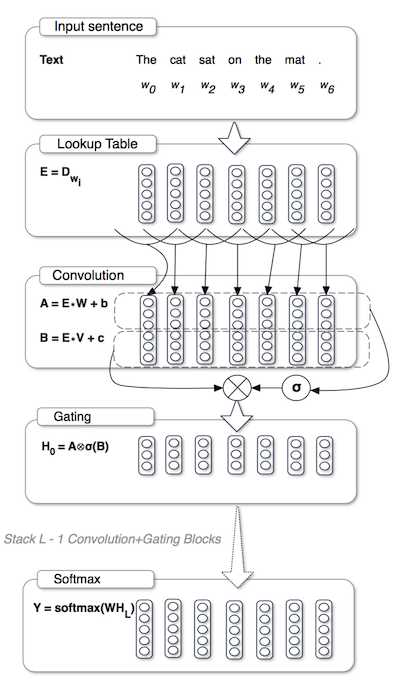

# Language Modeling with Gated Convolutional Networks

This is a Tensorflow implementation of Facebook AI Research Lab's paper: [Language Modeling with Gated Convolutional Networks](https://arxiv.org/abs/1612.08083). This paper applies a convolutional approach to language modelling with a novel Gated-CNN model.

## Architecture


## Requirements
- Download and extract the [Google 1 Billion Word dataset](http://www.statmt.org/lm-benchmark/1-billion-word-language-modeling-benchmark-r13output.tar.gz) in the `data` folder.

- [TensorFlow](https://www.tensorflow.org/)

## Usage
To train the model using the default hyperparameters:

```
$ python main.py
$ tensorboard --logdir=logs --host=0.0.0.0
```
Check `main.py` for tunable hyperparameter flags.

## TODO
- [ ] Replace NCE loss with Adaptive Softmax.
- [ ] Remove restricted training on fixed sized sentences (20, for now) and extend to account for all varied sentence lenghts.
- [ ] Train extensively on deeper models to match the results with the paper.


